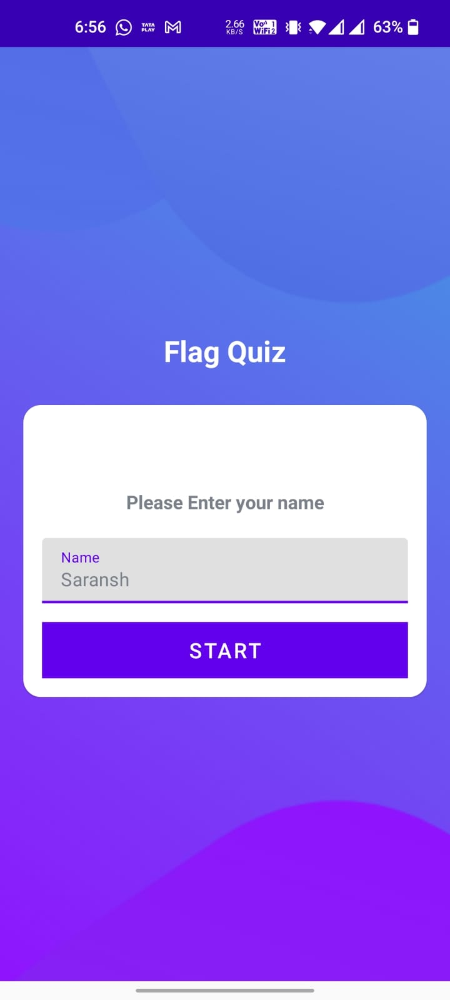
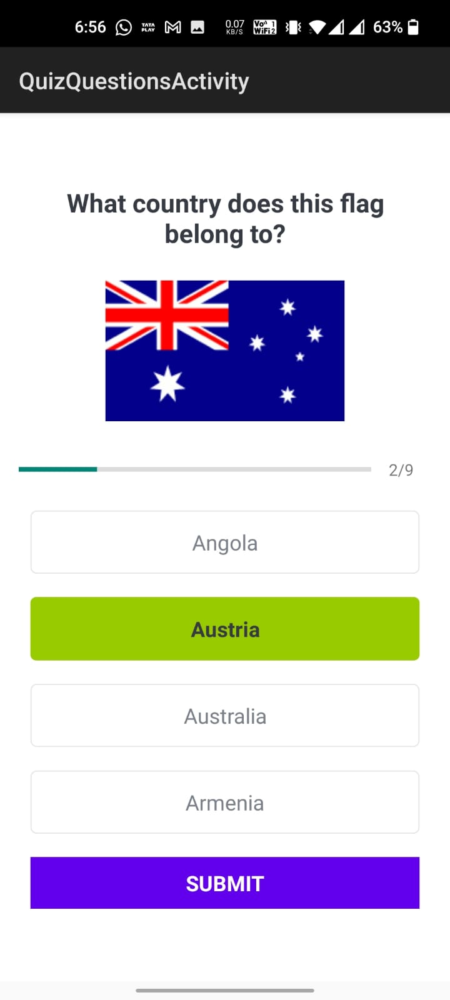
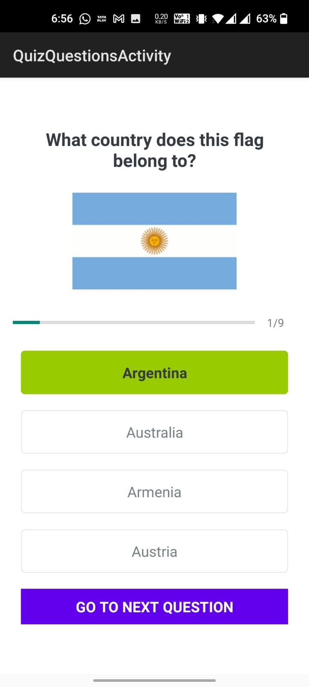
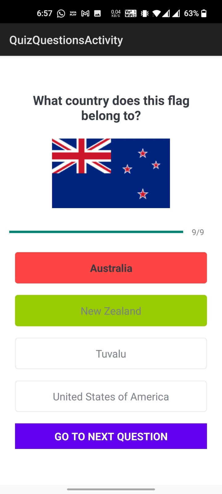
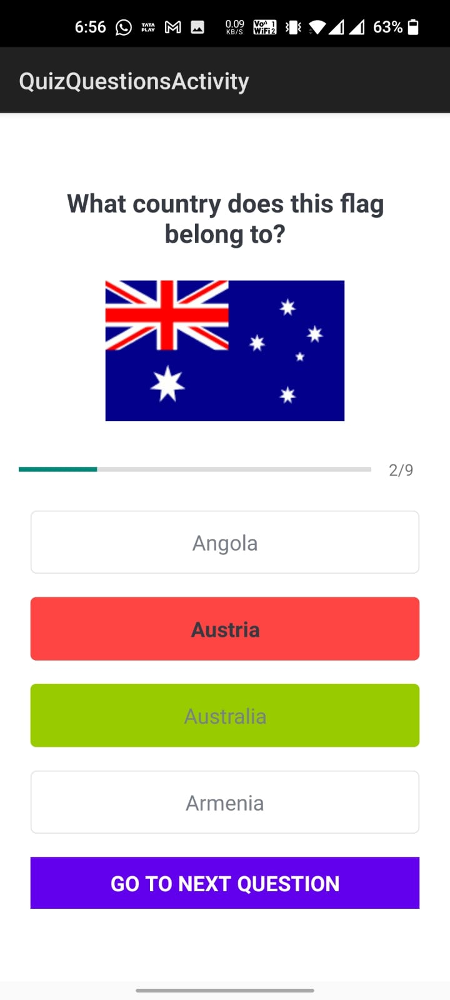
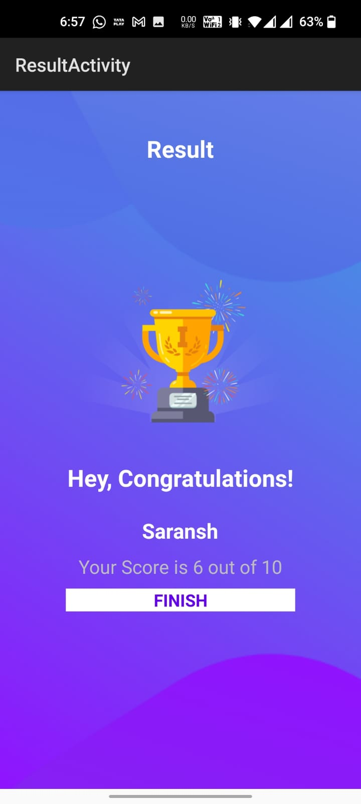

# Country Flag Quiz Application

It is an android country flag quiz application made by using Koltin, XML and android
studio in which the user identifies the flags of countries and if the choosen option is correct button turns green and if the choosen option is wrong the button turns green and a green button shows the correct option at the end score of the user is
displayed on the final screen with a finish button to replay the game

**Technologies used =>**

- Android Studio
- Kotlin
- XML

**ScreenShots =>**

- Main Screen

- Correct Guess

- Wrong Guess

- Final Screen

